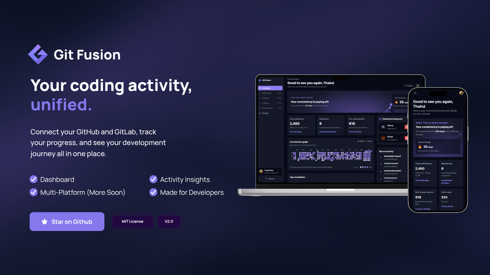

# Git Fusion



Git Fusion is a Next.js app that brings GitHub and GitLab activity into one authenticated dashboard. Users can sign up, connect their provider accounts through OAuth, and view consolidated contribution insights without relying on personal access tokens in the browser. More providers are planned to the future.

Try it out: [https://gitfusion.thaipires.com](https://gitfusion.thaipires.com)

## Features

- Supabase authentication with sign in and sign up pages.
- Authenticated dashboard for connected GitHub and GitLab accounts.
- OAuth-based provider connection and disconnection flows.
- Consolidated contribution overview across providers.
- Dashboard metrics, contribution chart, repository highlights, and recent activity.
- Profile settings with avatar upload through Supabase Storage.
- Cached dashboard overview backed by persisted daily contribution totals.
- Server-side token handling with encrypted provider tokens.

## Tech Stack

- [Next.js](https://nextjs.org/) 15
- [React](https://react.dev/) 19
- [Supabase](https://supabase.com/) for auth, database, and avatar storage
- [HeroUI](https://www.heroui.com/) and Tailwind CSS for UI
- [TanStack Query](https://tanstack.com/query) for client-side data fetching
- [Framer Motion](https://www.framer.com/motion/) for animation

## Getting Started

### 1. Install dependencies

```bash
npm install
```

### 2. Configure environment variables

Copy the example file and fill in the required values:

```bash
cp .env.local.example .env.local
```

Required variables:

```env
NEXT_PUBLIC_SUPABASE_URL=
NEXT_PUBLIC_SUPABASE_ANON_KEY=

SUPABASE_SERVICE_ROLE_KEY=

GITHUB_OAUTH_CLIENT_ID=
GITHUB_OAUTH_CLIENT_SECRET=
GITLAB_OAUTH_CLIENT_ID=
GITLAB_OAUTH_CLIENT_SECRET=

# Recommended for production token encryption
GITFUSION_TOKEN_ENCRYPTION_KEY=
```

Notes:

- `NEXT_PUBLIC_SUPABASE_URL` and `NEXT_PUBLIC_SUPABASE_ANON_KEY` are public client-side Supabase values.
- `SUPABASE_SERVICE_ROLE_KEY` must stay server-side only.
- `GITFUSION_TOKEN_ENCRYPTION_KEY` should be a long, stable random string. Do not rotate it after users connect accounts unless you are prepared to invalidate/reconnect encrypted provider tokens.
- Use the exact variable name `GITFUSION_TOKEN_ENCRYPTION_KEY` in every environment. If production and local use different encryption keys, existing connected accounts may need to be reconnected.
- If `GITFUSION_TOKEN_ENCRYPTION_KEY` is not set, the app falls back to `SUPABASE_SERVICE_ROLE_KEY` for token encryption, but a dedicated key is recommended.

### 3. Configure Supabase

Create a Supabase project, then link it locally:

```bash
npm run supabase:link
```

Apply the database migrations:

```bash
npm run supabase:push
```

The migrations create:

- `profiles`
- public `avatars` storage bucket
- `connected_accounts`
- `oauth_states`
- `dashboard_overview_cache`
- `sync_runs`
- `contribution_daily_totals`
- required RLS policies, grants, indexes, and triggers

### 4. Configure OAuth apps

Create OAuth applications for GitHub and GitLab, then add their client IDs and secrets to `.env.local`.

Use these callback URLs:

```txt
http://localhost:3000/api/integrations/github/callback
http://localhost:3000/api/integrations/gitlab/callback
```

For production, replace the origin with your deployed domain:

```txt
https://your-domain.com/api/integrations/github/callback
https://your-domain.com/api/integrations/gitlab/callback
```

Provider scopes used by the app:

- GitHub: `read:user user:email`
- GitLab: `read_user read_api`

### 5. Run the app

```bash
npm run dev
```

Open [http://localhost:3000](http://localhost:3000).

## Scripts

```bash
npm run dev
npm run build
npm run start
npm run lint
npm run typecheck
npm run test
npm run test:run
npm run ci
npm run supabase:link
npm run supabase:push
```

## Testing and CI

The project uses Vitest for focused server/API tests. The current suite covers:

- `/api/integrations/accounts` account listing and disconnect behavior
- `/api/dashboard/overview` authorization, refresh handling, and known application errors
- provider token encryption/decryption behavior, including mismatched encryption keys

Run the tests locally:

```bash
npm run test:run
```

Run the same verification chain used by CI:

```bash
npm run ci
```

The CI workflow in `.github/workflows/pr-checks.yml` runs on pull requests targeting `main` and on pushes to `main`. It installs dependencies with `npm ci`, then runs lint, typecheck, tests, and the production build.

## Project Structure

```txt
src/app                     Next.js routes and API handlers
src/components              Shared UI components
src/lib                     Client/server utilities and provider helpers
src/server                  Server-side services, repositories, and domain modules
src/types                   Shared TypeScript types
supabase/migrations         Database schema migrations
```

## Dashboard Data Flow

The dashboard overview is loaded through `/api/dashboard/overview`.

The server attempts to use data in this order:

1. Fresh `dashboard_overview_cache`
2. Stored `contribution_daily_totals`, when accounts have a recent sync
3. Provider APIs, followed by persistence of daily totals and cache refresh

Provider tokens are stored encrypted in Supabase and are never returned to the frontend.

## Deployment Notes

- Configure public variables as regular config values:
  - `NEXT_PUBLIC_SUPABASE_URL`
  - `NEXT_PUBLIC_SUPABASE_ANON_KEY`
  - `GITHUB_OAUTH_CLIENT_ID`
  - `GITLAB_OAUTH_CLIENT_ID`
- Configure sensitive values as secrets:
  - `SUPABASE_SERVICE_ROLE_KEY`
  - `GITFUSION_TOKEN_ENCRYPTION_KEY`
  - `GITHUB_OAUTH_CLIENT_SECRET`
  - `GITLAB_OAUTH_CLIENT_SECRET`
- Apply Supabase migrations before connecting production accounts.
- Make sure production OAuth callback URLs match the deployed domain exactly.

## License

This project is licensed under the MIT License.
